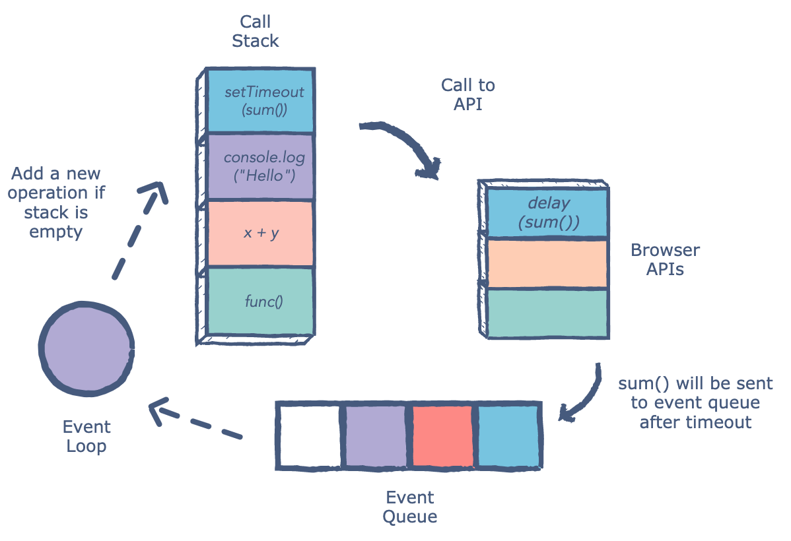

## What is a ‘call’?

A call stack is a mechanism for an interpreter (like the JavaScript interpreter in a web browser) to keep track of its place in a script that calls multiple functions — what function is currently being run and what functions are called from within that function

## How many ‘calls’ can happen at once?

When a script calls a function, the interpreter adds it to the call stack and then starts carrying out the function.
Any functions that are called by that function are added to the call stack further up, and run where their calls are reached.
When the current function is finished, the interpreter takes it off the stack and resumes execution where it left off in the last code listing.
If the stack takes up more space than it had assigned to it, it results in a "stack overflow" error.

## What does LIFO mean?
When we say that the call stack, operates by the data structure principle of Last In, First Out, it means that the last function that gets pushed into the stack is the first to be pop out, when the function returns.

Draw an example of a call stack and the functions that would need to be invoked to generate that call stack.

## What causes a Stack Overflow?

The most-common cause of stack overflow is excessively deep or infinite recursion, in which a function calls itself so many times that the space needed to store the variables and information associated with each call is more than can fit on the stack

## What is a ‘refrence error’?
when you try to use a variable that is not yet declared you get this type os errors.

## What is a ‘syntax error’?

this occurs when you have something that cannot be parsed in terms of syntax, like when you try to parse an invalid object using JSON.parse.

## What is a ‘range error’?

an object with some kind of length and give it an invalid length

## What is a ‘tyep error’?

when the types (number, string and so on) you are trying to use or access are incompatible, like accessing a property in an undefined type of variable.

## What is a breakpoint?

a point in the program where the code will stop executing.

## What does the word ‘debugger’ do in your code?

Debuggers allow users to halt the execution of the program, examine the values of variables, step execution of the program line by line, and set breakpoints on lines or specific functions that, when hit, will halt execution of the program at that spot.

